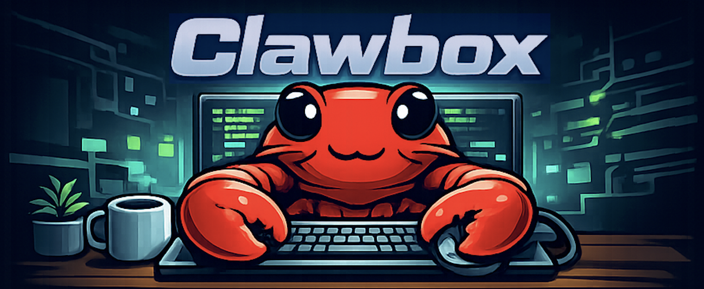

<p align="center">
  
</p>

<p align="center">
  <strong>Run a self-hosted AI agent safely on your everyday computer.</strong><br/>
  No VPS. No Mac Mini. No server closet. Just Docker on the laptop or desktop you already have.
</p>

<p align="center">
  Clawbox is a hardened, one-command setup for <a href="https://github.com/openclaw/openclaw">OpenClaw</a> with built-in web search.<br/>
  Everything runs inside Docker containers — nothing touches your host system.
</p>

---

## Why Clawbox?

Most AI agent setups assume you have a dedicated server or cloud VM. Clawbox is different — it's **designed to run on your personal machine** and locked down so you can do it safely:

- **Nothing escapes Docker** — the agent, its tools, and the search engine all run inside containers. Your host filesystem, apps, and data stay untouched.
- **Hardened by default** — localhost-only networking, command approval prompts, and sandboxed execution. No open ports, no surprises.
- **Your laptop is enough** — if it runs Docker Desktop, it runs Clawbox. No need to rent a VPS or dedicate hardware.

## What you get

- **OpenClaw** — AI agent gateway with a browser-based chat UI
- **SearXNG** — self-hosted metasearch engine (private, no tracking, no API keys)
- **Web search out of the box** — the agent can search the web and read URLs immediately
- **Hardened by default** — localhost-only, sandboxed, with exec approvals
- **Cross-platform** — works on macOS, Linux, WSL, and Windows

## Requirements

- **Docker Desktop** — [download here](https://www.docker.com/products/docker-desktop/) (includes Docker Compose)
  - macOS: Docker Desktop for Mac
  - Windows: Docker Desktop for Windows (with WSL 2 backend)
  - Linux: Docker Engine + Docker Compose v2 (`docker compose` command)
- **Git** — to clone the repository
- **An AI provider account** — one of:
  - **OpenAI** (recommended) — uses OAuth login, no API key needed
  - **Anthropic** — requires an API key

## Quick start

### macOS / Linux

```bash
git clone https://github.com/iceHub82/clawbox.git
cd clawbox
./setup.sh
```

### Windows (PowerShell)

```powershell
git clone https://github.com/iceHub82/clawbox.git
cd clawbox
.\setup.ps1
```

### What the setup script does

1. Creates configuration files
2. Pulls the Docker images
3. Starts the containers (OpenClaw + SearXNG)
4. Installs web search tools inside the gateway
5. Applies security hardening
6. Launches the configuration wizard (see below)
7. Opens your browser automatically

### Configuration wizard

During setup, you'll be guided through these steps:

1. **"Where will the Gateway run?"** → Select **Local (this machine)**
2. **"Select sections to configure"** → Select **Model** (Pick provider + credentials)
3. **Choose your AI provider and model**
   - For **OpenAI**: a browser window opens for OAuth login — no API key needed
   - For **Anthropic**: paste your API key when prompted
4. **"Select sections to configure"** → Select **Continue** (Done)

Once complete, your browser opens to the OpenClaw chat UI — you're ready to go.

## Security

> **Running an AI agent on your local machine carries real risk.** The agent can execute shell commands, read/write files, and access your network. Clawbox takes this seriously and ships **hardened by default** — every layer is locked down out of the box.

### What hardened mode does

| Layer | Protection | Why it matters |
|---|---|---|
| **Network isolation** | Gateway bound to `localhost` only | No one on your network can access the agent |
| **Exec approvals** | Agent must ask before running any command | You review and approve every shell command |
| **Sandbox** | Agent tools run in isolated Docker containers | Commands can't touch your host filesystem |
| **Internal SearXNG** | Search engine not exposed to host | Only the agent can reach it, not your browser or LAN |
| **Auth token** | Gateway requires a token to connect | Prevents unauthorized access even on localhost |
| **Docker isolation** | Everything runs inside containers | Nothing is installed on your host system |

### Hardened vs Open mode

| Setting | Hardened (default) | Open (`--open`) |
|---|---|---|
| Port binding | localhost only | LAN-accessible |
| Exec approvals | Required — you approve every command | Off |
| Sandbox | Enabled — isolated containers | Off |
| SearXNG | Internal only | Exposed on host |

**We strongly recommend running in hardened mode** unless you specifically need LAN access. To disable hardening:

```bash
./setup.sh --open          # macOS / Linux
.\setup.ps1 -Open          # Windows
```

### Security tips

- **Never run `--open` on an untrusted network** — it exposes the agent to your entire LAN
- **Review exec approvals carefully** — the agent will show you the command before running it
- **Keep Docker Desktop updated** — container isolation depends on it
- **Don't store sensitive files in the workspace directory** — the agent has full access to it

## Architecture

```
Browser → OpenClaw Gateway (:18789)
              ↓ (bash tool)
           mcporter → mcp-searxng (stdio) → SearXNG (:8080)
```

Two persistent containers:
1. **openclaw-gateway** — runs the AI agent, mcporter, and mcp-searxng
2. **searxng** — local metasearch engine with JSON API

## Common commands

| Command | Description |
|---|---|
| `./oc configure` | Re-run the configuration wizard |
| `./oc token` | Show the gateway auth token |
| `docker compose stop` | Stop all containers |
| `docker compose up -d` | Start all containers |
| `docker compose down` | Stop and remove containers |

## Troubleshooting

**"Pairing required" in the browser**
The setup script auto-approves the browser device. If it didn't work, refresh the page. If it still shows, run:
```bash
./oc devices list
```
Then approve the pending device ID shown.

**Gateway not accessible**
Make sure Docker Desktop is running and the containers are up:
```bash
docker compose ps
```

**Want to start fresh?**
```bash
docker compose down -v
rm -rf data/ .env
./setup.sh
```

## Customization

Copy `.env.example` to `.env` to customize ports, paths, and image tags. The setup script creates this automatically, but you can edit it afterwards:

| Variable | Default | Description |
|---|---|---|
| `OPENCLAW_GATEWAY_PORT` | `18789` | Gateway UI port |
| `OPENCLAW_BRIDGE_PORT` | `18790` | Bridge port |
| `SEARXNG_PORT` | `8888` | SearXNG port (open mode only) |
| `BIND_HOST` | `127.0.0.1` | `127.0.0.1` = localhost, `0.0.0.0` = LAN |
| `OPENCLAW_IMAGE` | `ghcr.io/openclaw/openclaw:latest` | Docker image |

## Adding more MCP tools

You can extend the agent with additional [MCP](https://modelcontextprotocol.io/) tools:

```bash
# Install the MCP server package
docker exec -u root clawbox-openclaw-gateway-1 npm install -g <mcp-package>

# Register it with mcporter
docker exec clawbox-openclaw-gateway-1 mcporter config add <name> \
  --command <mcp-binary> --scope home
```

The agent can then use it via `mcporter call <name>.<tool> key=value`.

## License

MIT
